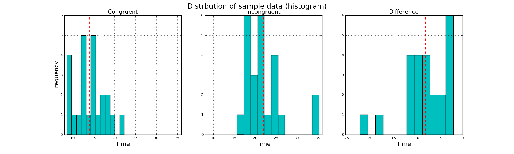
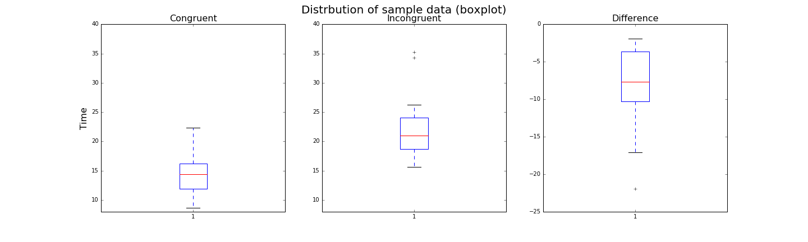

## Project 1: Stroop Effect  
#### Liang Sun            
#### November 22, 2016

### Questions for investigation

#### 1. What is our independent variable? What is our dependent variable?

The independent variable is the word condition, that is, whether the respondent is reading in a congruent or an incongruent words condition. The dependent variable is the time that the respondent takes for color reading all of the words shown in one of the two conditions. 

#### 2.What is an appropriate set of hypotheses for this task? What kind of statistical test do you expect to perform? Justify your choices.

The null hypothesis is that people take equal amount of time to read colors of words in congruent and incongruent conditions. The alternative hypothesis is that people averagely take more time to read colors of words in incongruent condition than in congruent condition. 

Suppose the population mean of time that people take to read colors in congruent condition is $\mu_0$, and the population mean of time that people take to read colors in incongruent condition is $\mu_1$, then we have,

$$H_0: \mu_0 = \mu_1$$
$$H_A: \mu_0 < \mu_1$$

I expect to perform a one-tailed dependent sample t-test, because:
* First of all,population distribution and standard deviation are unknown, and our sample size is less than 30, so z-score is not appropriate here since it requires our knowledge about the population and a sample size above 30. Instead, t-test, which is based on sample means, can be used for hypothesis testing given a known,small sample. Because of the central limit theorem, the distribution of sample means, in repeated sampling, converges to a normal distribution, regardless of the population distribution. The sampling distribution of a sample with size 24 is also approximately normal. However, we need to assume that the sample distribution is approximately normal in order to perform the t-test. Theoretically, the data for t-test should be a simple random sample from the population, and the data should follow a normal distribution, but in a small sample, it is hard to detect non-normality. If non-normality does exist, the power of t-test will be reduced. In this case, we assume that the population distribution is normal since pyschological measurements usually result in normal distribution, and that our data were sampled randomly. We can thereby assume that our sample is approximately normal.  
* In addition, in this experiment each respondent reads colors of words in both congruent words condition and incongruent words condition, which means the samples for both words conditions are identical and paired. 
* Moreover, from our sample data we can intuitively observe that people take more time to read in incongruent condition than in congruent condition. It will be more specific to perform a one-tailed t-test than a two-tailed t-test. 

Therefore, a one-tailed dependent sample t-test is appropriate here to examine whether the population significantly take more time to read colors of words in incongruent condition than in congruent condition based on our sample.

#### 3. Report some descriptive statistics regarding this dataset. Include at least one measure of central tendency and at least one measure of variablity.

* The means of the time respondents take to read colors in congruent and incongruent conditions are: 
$$ \bar{X}_0 = 14.05 $$
$$ \bar{X}_1 = 22.02 $$

    The mean of the difference between the time respondents take to read colors in two different conditions is:
    $$ \bar{X}_0 - \bar{X}_1 = -7.97 $$
    which is the point estimate of $\mu_0-\mu_1$.

* The standard deviation of the difference between the time respondents take to read colors in two different conditions is:
$$ s=4.86 $$
which is the unbiased estimate of the standard deviation of the population difference.

#### 4. Provide one or two visualizations that show the distribution of the sample data.Write one or two sentences noting what you observe about the plot or plots.

 

 

The red vertical line in the histogram graph stands for where the mean of time lies. Both histogram and boxplot suggest that the mean of time used to read colors of words in congruent condition seems to be smaller than that in incongruent condition. In addition, both graphs show that the mean of difference is away from and smaller than the value 0, which implies that the means of time used to read colors of words in two conditions are likely to be different.

#### 5. Now, perform the statistical test and report your results. What is your confidence level and your critical statistic value? Do you reject the null hypothesis or fail to reject it? Come to a conclusion in terms of the experiment task. Did the results match up with your expectations?

Given $\mu_0-\mu_1=-7.97, s=4.86, n=24 $,
$$ t=\frac{\mu_0-\mu_1}{s/\sqrt{n}}=-8.02$$

Since we are performing a one-tailed t-test, and $ \alpha=.05, df=24-1=23$,we can get left-tail t-critical value from the t-table,

$$ t_{critical}=-1.714 $$

As \\(t<t_{critical}\\), and the one-tailed p-value \\(<.00001<\alpha\\), we can reject the null hypothesis on 95% confidence level, and draw a conclusion that the mean of time used to read colors of words in incongruent condition is significantly larger than that in congruent condition with a 95% confidence level. The results match up with my expectation.

#### 6. Optional: What do you think is responsible for the effects observed? Can you think of an alternative or similar task that would result in a similar effect? Some research about the problem will be helpful for thinking about these two questions!

I think the effects observed are mainly due to the mismatch of visual information in terms of colors of words and literal information in terms of meanings of words that are shown to respondents. When respondents receive mismatching information of these two, naming the color of a word is disturbed by seeing the word which means a different color. Therefore,respondents' reaction to naming colors of words is slowed in such an incongruent condition.

The effect was named after John Stroop, who published the effect in Germany in 1929 and in English in 1935. In one of his experiments, he created two stimuli, names of colors appeared in a different ink than the color named, and squares of a given color. He found that participants took much longer to name colors in the former stimulus than they took to name colors of the squares in the latter stimulus. He explained that *"human being's mind automatically determines the semantic meaning of the word (it reads the word "red" and thinks of the color "red"), and then must intentionally check itself and identify instead the color of the word (the ink is a color other than red), a process that is not automated."* (Source: Wikipedia)

I once participated in a pyschological experiment which asked me to name items when words and images were shown in congruent and incongruent conditions. I did not know about Stroop effect at then, but now I think it was probably a variant of Stroop effect experiment or something of similar mechanism. In the experiment I took, in the first task I was shown a group of matching words and images simultaneously. For example, the word "elephant" and a picture of an elepant showed up at the same time, and I spoke "elephant". In the second task, words and images became mismatching. For example, the word "banana" and a picture of "pencil" might appear together, and I needed to name the item in the picture. Apparently, I made more mistakes or reacted more slowly in the second task.

Through searching online, I learned that researchers call the experiment I participated in "picture-word interference effect" and consider it to be Stroop-like effect (Glaser,1989; van Maanen & van Rijn, 2008). They reveal a similar effect to Stroop effect and explain that words have privileged access than pictures or colors to the lexicon which people employ to name target items.  

#### Reference and resources links

* **Glaser (1998)** (https://<i></i>www.ncbi.nlm.nih.gov/pubmed/2522504)
* **Markdown Cheatsheet** (https://<i></i>github.com/adam-p/markdown-here/wiki/Markdown-Cheatsheet)
* **Matplotlib** (http://<i></i>www.python-course.eu/matplotlib_multiple_figures.php)
* **Normal Distribution** (http://<i></i>psychology.jrank.org/pages/454/Normal-Distribution.html)
* **T-score vs. Z-score** (http://<i></i>www.statisticshowto.com/when-to-use-a-t-score-vs-z-score/)
* **The T-test and Robustness to Non-normality** (http://<i></i>thestatsgeek.com/2013/09/28/the-t-test-and-robustness-to-non-normality/)
* **van Maanen & van Rign (2008)** (http://<i></i>www.ai.rug.nl/~leendert/pubs/assets/VanMaanenVanRijnCogSci2008.pdf)
* **Visualization** (http://<i></i>pandas.pydata.org/pandas-docs/version/0.18.1/visualization.html)
* **Wikipedia: Stroop effect** (https://<i></i>en.wikipedia.org/wiki/Stroop_effect)
* **Writing Mathematic Formulas in Markdown** (http://<i></i>csrgxtu.github.io/2015/03/20/Writing-Mathematic-Fomulars-in-Markdown/)
